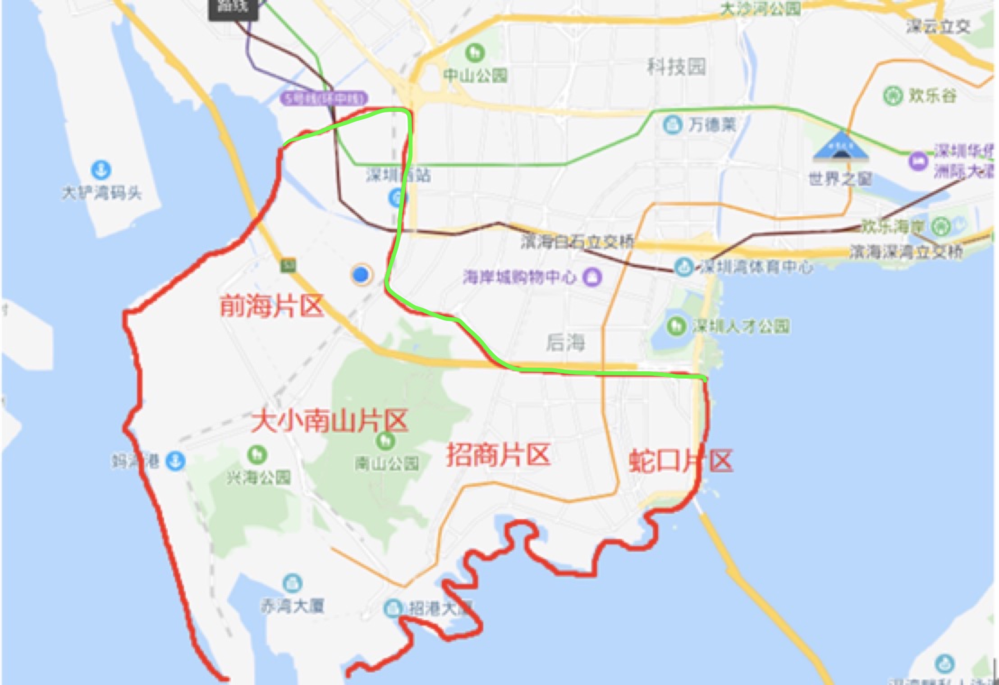

# 批量处理excel数据

## 问题描述

excel中存有很多地址信息，现在需要判断每一行地址是否在下图指定区域中（红色圈内）



## 思路

1. 比较繁琐，手工标出非海岸边界线上面一系列的点（上图中绿色重绘部分），记录到`/edge-line.txt`
```
22.5397491630,113.8857781177
22.5312793256,113.8938006894
22.5247910999,113.9096123961
22.5211288837,113.9243716545
22.5185719118,113.9334556475
22.5199793236,113.9485477987
```

这一步操作纯手工，可以使用在线工具：[经纬度在线工具](http://www.gpsspg.com/maps.htm)

2. 根据以上的点,使用`numpy.polyfit`拟合这条曲线的多项式方程

3. 遍历Excel里面的数据，根据每一行的经纬度，代入得到的多项式方程，判断该地址是在曲线上面还是下面